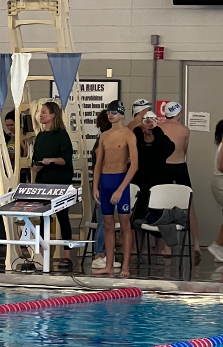
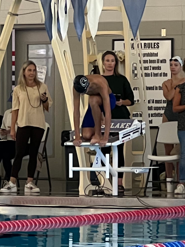
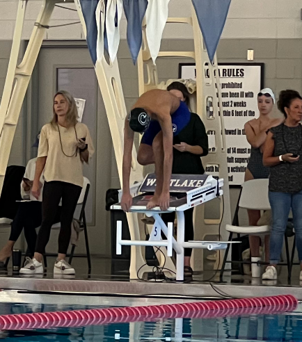

---
# Feel free to add content and custom Front Matter to this file.

layout: default
---

#### 2024 ST TXLA 11& Over November Unclassified, November 24-26, 2024
{:style="text-align:center"}

<!---
<sl-carousel class="aspect-ratio" navigation pagination mouse-dragging loop style="--aspect-ratio: 1/1;">
  <sl-carousel-item>
    
  </sl-carousel-item>
  <sl-carousel-item>
    
  </sl-carousel-item>
  <sl-carousel-item>
    
  </sl-carousel-item>
</sl-carousel>
-->

 
**Sunday pm**

  <table class="table">
    <thead>
      <tr>
        <th>Event</th>
        <th>Start Time</th>
        <th>Race</th>
        <th>Heat</th>
        <th>Lane</th>
        <th>Seed Time</th>
        <th>Seed Grade</th>
        <th>Race Time</th>
        <th>Race Grade</th>
        <th>Place</th>
        <th>Race Videos</th>
      </tr>
    </thead>
    <tbody>
      <tr>
        <td>7</td>
        <td>1:45pm</td>
        <td>200 FR</td>
        <td>23</td>
        <td>4</td>
        <td>2:34.55</td>
        <td><sl-badge variant="neutral" pill>{{get_grade("12","boys","single_age","200","fr","scy","2:34.55")}}</sl-badge></td>
        <td>2:09.71</td>
        <td><sl-badge variant="success" pill pulse>{{get_grade("12","boys","single_age","200","fr","scy","2:09.71")}}</sl-badge></td>
        <td>2nd</td>
        <td><a href="https://youtu.be/O1jzGURjHOk">Watch on YouTube</a></td>
      </tr>
      <tr>
        <td>9</td>
        <td>2:57pm</td>
        <td>50 BK</td>
        <td>26</td>
        <td>8</td>
        <td>41.37</td>
        <td><sl-badge variant="neutral" pill>{{get_grade("12","boys","single_age","50","bk","scy","41.37")}}</sl-badge></td>
        <td>33.91</td>
        <td><sl-badge variant="success" pill pulse>{{get_grade("12","boys","single_age","50","bk","scy","33.91")}}</sl-badge></td>
        <td>1st</td>
        <td><a href="https://youtu.be/sHs3sTtuWCQ">Watch on YouTube</a></td>
      </tr>
      <tr>
        <td>11</td>
        <td>3:31pm</td>
        <td>50 FR</td>
        <td>3</td>
        <td>3</td>
        <td>25.93</td>
        <td><sl-badge variant="neutral" pill>{{get_grade("12","boys","single_age","50","fr","scy","25.93")}}</sl-badge></td>
        <td>...</td>
        <td>...</td>
        <td>...</td>
        <td>...</td>
      </tr>
    </tbody>
  </table>

**Monday pm**

  <table class="table">
    <thead>
      <tr>
        <th>Event</th>
        <th>Start Time</th>
        <th>Race</th>
        <th>Heat</th>
        <th>Lane</th>
        <th>Seed Time</th>
        <th>Seed Grade</th>
        <th>Race Time</th>
        <th>Race Grade</th>
        <th>Place</th>
        <th>Race Videos</th>
      </tr>
    </thead>
    <tbody>
      <tr>
        <td>19</td>
        <td>2:17pm</td>
        <td>100 FR</td>
        <td>3</td>
        <td>1</td>
        <td>56:49</td>
        <td><sl-badge variant="neutral" pill>{{get_grade("12","boys","single_age","100","fr","scy","56.49")}}</sl-badge></td>
        <td>...</td>
        <td>...</td>
        <td>...</td>
        <td>...</td>
      </tr>
      <tr>
        <td>22</td>
        <td>3:29pm</td>
        <td>100 FL</td>
        <td>12</td>
        <td>3</td>
        <td>1:15.99</td>
        <td><sl-badge variant="neutral" pill>{{get_grade("12","boys","single_age","100","fl","scy","1:15.99")}}</sl-badge></td>
        <td>...</td>
        <td>...</td>
        <td>...</td>
        <td>...</td>
      </tr>
      <tr>
        <td>24</td>
        <td>4:09pm</td>
        <td>200 IM</td>
        <td>7</td>
        <td>5</td>
        <td>2:29.80</td>
        <td><sl-badge variant="neutral" pill>{{get_grade("12","boys","single_age","200","im","scy","2:29.80")}}</sl-badge></td>
        <td>...</td>
        <td>...</td>
        <td>...</td>
        <td>...</td>
      </tr>
    </tbody>
  </table>

**Meet Information**
- [Timeline](https://www.gomotionapp.com/stccsst/UserFiles/Image/QuickUpload/11-o-nuc-timeline_022917.pdf)
- [Psych Sheet](https://www.gomotionapp.com/stccsst/UserFiles/Image/QuickUpload/11-o-nuc-psych-sheet_082769.pdf)
- Heat Sheets:
  - [Sunday pm](https://www.gomotionapp.com/stccsst/UserFiles/Image/QuickUpload/sunday-pm--11-13-heat-sheet_024302.pdf)
  - [Monday pm](https://www.gomotionapp.com/stccsst/UserFiles/Image/QuickUpload/monday-pm--11-13-heat-sheet_026563.pdf)
- [Purchase Parking Pass](https://utparking.clickandpark.com/)
- [Results](http://www.txlameetresults.com/)

**Sunday PM & Monday PM, 11-13 sessions**
- Warm-ups are general. No lanes will be assigned. We will run fly over starts for all events. ALL events will run odd/even heats
- Sunday PM: Warm-ups begin at 12:45 PM, Start lanes will open at 1:15 PM, Pool clears at 1:35 PM, Meet starts at 1:45 PM
- Monday PM: Warm-ups begin at 1:00 PM, Start lanes will open at 1:30 PM, Pool clears at 1:50 PM, Meet start at 2:00 PM
- All races are Short Course and all distances are Yards

Here are [some of the CMC's past swim meets](/meets/)

If you're looking to calculate the letter grade associated with a swimmer's race time based on USA Swimming's Motivational times, check out the [SwimGrade form](/swimming/swim_grade/)

