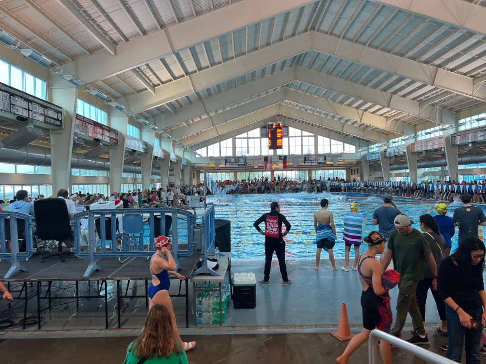
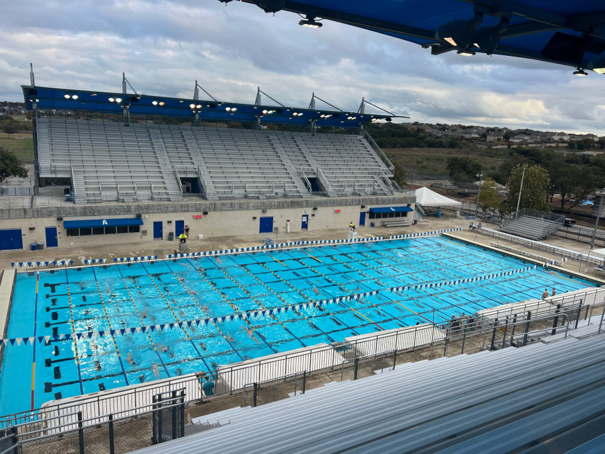
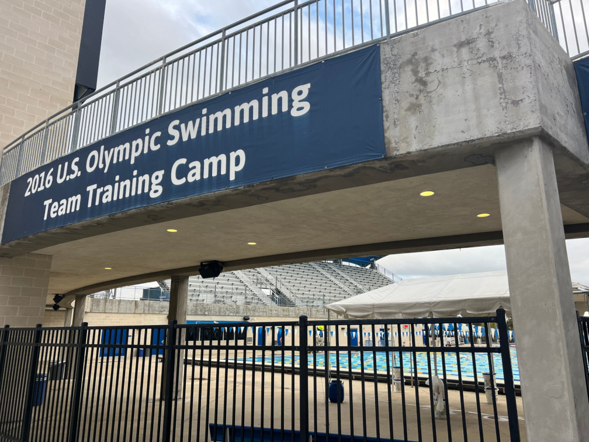

---
# Feel free to add content and custom Front Matter to this file.

layout: default
---

#### 2024 ST Winter Wonderland
{:style="text-align:center"}

<sl-carousel class="aspect-ratio" navigation pagination mouse-dragging loop style="--aspect-ratio: 1/1;">
  <sl-carousel-item>
    
  </sl-carousel-item>
  <sl-carousel-item>
    
  </sl-carousel-item>
  <sl-carousel-item>
    
  </sl-carousel-item>
</sl-carousel>

**Finals**

  <table class="table">
    <thead>
      <tr>
        <th>Race</th>
        <th>Time</th>
        <th>Grade</th>
        <th>Videos</th>
      </tr>
    </thead>
    <tbody>
      <tr>
        <td>50 BR</td>
        <td>36.04</td>
        <td><sl-badge variant="success" pill>{{get_grade("12","boys","single_age","50","br","scy","36.04")}}</sl-badge></td>
        <td><a href="https://youtu.be/LN9lxxTpvBc">Watch (lane 7, 5th place)</a></td>
      </tr>
      <tr>
        <td>100 IM</td>
        <td>1:10.03</td>
        <td><sl-badge variant="primary" pill>{{get_grade("12","boys","single_age","100","im","scy","1:10.03")}}</sl-badge></td>
        <td><a href="https://youtu.be/tUXZ8pYUOYk">Watch (lane 5, 9th place)</a></td>
      </tr>
      <tr>
        <td>100 FR</td>
        <td>57.93</td>
        <td><sl-badge variant="success" pill pulse>{{get_grade("12","boys","single_age","100","fr","scy","57.93")}}</sl-badge></td>
        <td><a href="https://youtu.be/0ypuOBTmFzQ">Watch (lane 7, 5th place)</a></td>
      </tr>
    </tbody>
  </table>

 

**Prelims**

  <table class="table">
    <thead>
      <tr>
        <th>Race</th>
        <th>Time</th>
        <th>Grade</th>
        <th>Videos</th>
      </tr>
    </thead>
    <tbody>
      <tr>
        <td>50 BR</td>
        <td>36.74</td>
        <td><sl-badge variant="primary" pill>{{get_grade("12","boys","single_age","50","br","scy","36.74")}}</sl-badge></td>
        <td><a href="https://youtu.be/uh-V46o-15U">Watch (lane 7, 7th place)</a></td>
      </tr>
      <tr>
        <td>100 IM</td>
        <td>1:10.46</td>
        <td><sl-badge variant="primary" pill>{{get_grade("12","boys","single_age","100","im","scy","1:10.46")}}</sl-badge></td>
        <td><a href="https://youtu.be/HUBCRgkMSNA">Watch (lane 4, 10th place)</a></td>
      </tr>
      <tr>
        <td>100 FR</td>
        <td>59.53</td>
        <td><sl-badge variant="success" pill>{{get_grade("12","boys","single_age","100","fr","scy","59.53")}}</sl-badge></td>
        <td><a href="https://youtu.be/ApBqE9Jkafs">Watch (lane 7, 6th place)</a></td>
      </tr>
    </tbody>
  </table>

<!---
**Monday pm**

  <table class="table">
    <thead>
      <tr>
        <th>Event</th>
        <th>Start Time</th>
        <th>Race</th>
        <th>Heat</th>
        <th>Lane</th>
        <th>Seed Time</th>
        <th>Seed Grade</th>
        <th>Race Time</th>
        <th>Race Grade</th>
        <th>Place</th>
        <th>Race Videos</th>
      </tr>
    </thead>
    <tbody>
      <tr>
        <td>19</td>
        <td>2:17pm</td>
        <td>100 FR</td>
        <td>3</td>
        <td>1</td>
        <td>56:49</td>
        <td><sl-badge variant="neutral" pill>{{get_grade("12","boys","single_age","100","fr","scy","56.49")}}</sl-badge></td>
        <td>57.02</td>
        <td><sl-badge variant="success" pill>{{get_grade("12","boys","single_age","100","fr","scy","57.02")}}</sl-badge></td>
        <td>4th</td>
        <td><a href="https://youtu.be/CIc0trjmSW4">Watch on YouTube</a></td>
      </tr>
      <tr>
        <td>22</td>
        <td>3:29pm</td>
        <td>100 FL</td>
        <td>12</td>
        <td>3</td>
        <td>1:15.99</td>
        <td><sl-badge variant="neutral" pill>{{get_grade("12","boys","single_age","100","fl","scy","1:15.99")}}</sl-badge></td>
        <td>1:11.14</td>
        <td><sl-badge variant="primary" pill>{{get_grade("12","boys","single_age","100","fl","scy","1:11.14")}}</sl-badge></td>
        <td>1st</td>
        <td><a href="https://youtu.be/Z0ffOM3LqLY">Watch on YouTube</a></td>
      </tr>
      <tr>
        <td>24</td>
        <td>4:09pm</td>
        <td>200 IM</td>
        <td>7</td>
        <td>5</td>
        <td>2:29.80</td>
        <td><sl-badge variant="neutral" pill>{{get_grade("12","boys","single_age","200","im","scy","2:29.80")}}</sl-badge></td>
        <td>2:31.33</td>
        <td><sl-badge variant="primary" pill>{{get_grade("12","boys","single_age","200","im","scy","2:31.33")}}</sl-badge></td>
        <td>6th</td>
        <td><a href="">Watch (Lane 5, 6th place)</a></td>
      </tr>
    </tbody>
  </table>

-->

<!---
**Monday pm**

  <table class="table">
    <thead>
      <tr>
        <th>Race</th>
        <th>Time</th>
        <th>Grade</th>
        <th>Videos</th>
      </tr>
    </thead>
    <tbody>
      <tr>
        <td>100 FR</td>
        <td>57.02</td>
        <td><sl-badge variant="success" pill>{{get_grade("12","boys","single_age","100","fr","scy","57.02")}}</sl-badge></td>
        <td><a href="https://youtu.be/CIc0trjmSW4">Watch (lane 1, 4th place)</a></td>
      </tr>
      <tr>
        <td>100 FL</td>
        <td>1:11.14</td>
        <td><sl-badge variant="primary" pill>{{get_grade("12","boys","single_age","100","fl","scy","1:11.14")}}</sl-badge></td>
        <td><a href="https://youtu.be/Z0ffOM3LqLY">Watch (lane 3, 1st place)</a></td>
      </tr>
      <tr>
        <td>200 IM</td>
        <td>2:31.33</td>
        <td><sl-badge variant="success" pill>{{get_grade("12","boys","single_age","200","im","scy","2:31.33")}}</sl-badge></td>
        <td><a href="https://youtu.be/vcilbKPil8E">Watch (lane 5, 6th place)</a></td>
      </tr>
    </tbody>
  </table>

 

**Sunday pm**

  <table class="table">
    <thead>
      <tr>
        <th>Race</th>
        <th>Time</th>
        <th>Grade</th>
        <th>Videos</th>
      </tr>
    </thead>
    <tbody>
      <tr>
        <td>200 FR</td>
        <td>2:09.71</td>
        <td><sl-badge variant="success" pill>{{get_grade("12","boys","single_age","200","fr","scy","2:09.71")}}</sl-badge></td>
        <td><a href="https://youtu.be/O1jzGURjHOk">Watch (lane 4, 2nd place)</a></td>
      </tr>
      <tr>
        <td>50 BK</td>
        <td>33.91</td>
        <td><sl-badge variant="primary" pill>{{get_grade("12","boys","single_age","50","bk","scy","33.91")}}</sl-badge></td>
        <td><a href="https://youtu.be/sHs3sTtuWCQ">Watch (lane 8, 1st place)</a></td>
      </tr>
      <tr>
        <td>50 FR</td>
        <td>25.66</td>
        <td><sl-badge variant="success" pill pulse>{{get_grade("12","boys","single_age","50","fr","scy","25.66")}}</sl-badge></td>
        <td><a href="https://youtu.be/8vhYoHWHGuY">Watch (lane 3, 1st place)</a></td>
      </tr>
    </tbody>
  </table>

-->
 

**Meet Information**
- [2024 Winter Wonderland Meet Information](https://drive.google.com/drive/folders/1bpPLZ9ePcdh6FQ9MyQrNz-LvEB_uJuTH?usp=drive_link)
 

Here are [some of the CMC's past swim meets](/meets/)

If you're looking to calculate the letter grade associated with a swimmer's race time based on USA Swimming's Motivational times, check out the [SwimGrade form](/swimming/swim_grade/)

